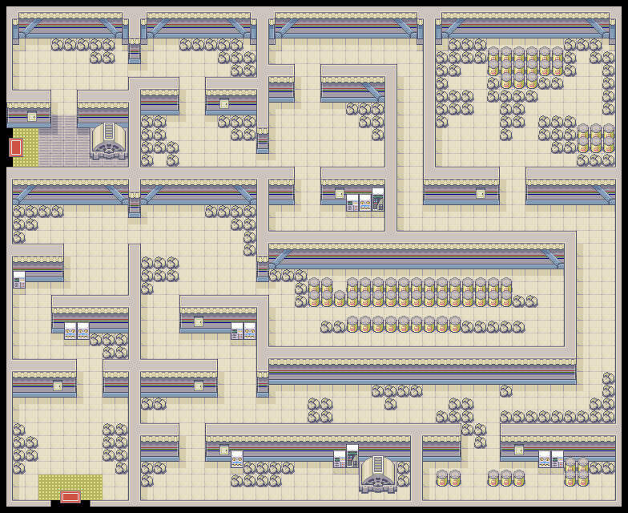

# frlg-render
This is a simple project which is designed to parse the assets decompiled from
Pokemon FireRed by the pret project and render those assets into the overworld
maps seen in the game. Eventually I'm interested in generating new maps with
this crate, but there's some work to do still.



## Running
You'll need to clone the [FireRed PRET repo](https://github.com/pret/pokefirered) 
to somewhere local.

Then, you can run with:
```sh
PRET_ROOT=/path/to/pokefirered cargo run -- --layout LAYOUT_POWER_PLANT --output ./power-plant.png
```

You should see a new file pop up that you can open and inspect which looks like
the one I've included above.